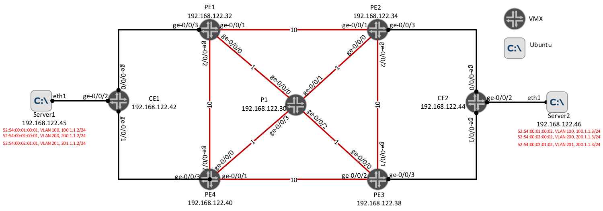

# Hackathon Juniper Automation

 Theses ansible playbooks will provision a network with ISIS/MPLS and EVPN
 
 ```
"ansible-playbook pb_armageddon.yml" : remove all the configuration from the routers
"ansible-playbook playbooks/pb_deploy.yml" : configure all the setup
"ansible-playbook playbooks/pb_checkall.yml" : check interface status, ISIS adjacency, BGP sessions states and routes.
 ```
Whole presentation of the hackathon :
* ansible-lab/slides.pdf

---
##Network topology


 ```
addressing :
192.168.1.0/24  Backbone
10.X.Y.Z Loopback
X = 1 → P router, X = 2 → PE router
Y = 1 → first router, Y = 2 → second router
Z = 1

Exemples:
router     mgnt/inet 
P1         10.1.1.1
PE1        10.2.1.1 
PE2        10.2.2.1 
PE3        10.2.3.1 
PE4        10.2.4.1 
 ```
- - - 
## Ansible
* documentation : https://github.com/ksator/ansible-training-for-junos-automation
* rcp commands : https://github.com/ksator/python-training-for-network-engineers/blob/master/rpc-netconf-lxml-ncclient/rpc.md
* examples : https://github.com/JNPRAutomate/ansible-junos-examples et https://github.com/JNPRAutomate/ansible-junos-evpn-vxlan
* list of modules Junos by Ansible https://docs.ansible.com/ansible/list_of_network_modules.html#junos
* list of modules Junos by Juniper http://junos-ansible-modules.readthedocs.io/en/1.4.0/

### Installation
```
administrator@server-2:~$ grep export .profile
export PYTHONSTARTUP=/home/administrator/.pythonrc

git clone https://github.com/Glench/Vim-Jinja2-Syntax.git ~/.vim/

sudo ansible-galaxy install Juniper.junos
```
modules of Juniper.junos are in /etc/ansible/roles/Juniper.junos/library


### Basic Ansible knowledge:
```
hosts                # hosts and groups association (inventory)
playbooks/bp_*       # playbook that makes what yu want
host_vars/           # directory with hosts variables one file/folder per host
group_vars/          # directory with groups variables one file/folder per group
roles/               # directory with the roles

the task is an action done by a module
a module make the action (file copy, template rendering, applying a command...)
a role allow to group tasks and files to reuse them in several playbooks
a play is a set of tasks/roles applied to a group of hosts
a playbook is a set of plays
```

You can find in a role:
```
roles/$ROLE/tasks/main.yml : action to run
roles/$ROLE/files/* : file to be copied on the host
roles/$ROLE/templates/* : templates to render
roles/$ROLE/meta/main.yml : list of other roles to run
roles/$ROLE/handler/main.yml : to run via "notify"
```

Create a role from scratch :
```
cd ansible-lab/roles
ansible-galaxy init $ROLE
```

###Execution
regular execution
```ansible-playbook playbook.yml```

run a playbook with arguments :
```ansible-playbook playbook.yml -e "arg1=foo port=['80']```

list of available variables :
```ansible -m setup hostname/group```

Run a command on all hosts (can be set to a group) :
```ansible all -a "/bin/echo hello"```

make a dry run of playbook and show difference without commiting
```ansible-playbook pb_deploy.yml --diff --check```

run task with only the specific tag and show difference (if any)
```ansible-playbook pb_deploy.yml --diff --tags "templating"```


- - - 
#Python / pyEz

* warm-up : https://stebe.info/2016/11/introduction-junos-pyez/
* Doc : https://github.com/Juniper/py-junos-eznc#documentation
* Examples : https://github.com/ksator/python-training-for-network-engineers


##Installation
```pip install junos-eznc```
